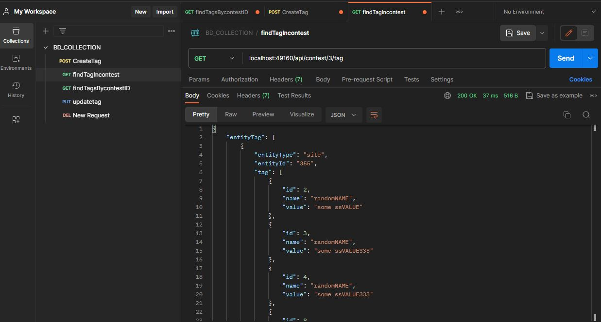
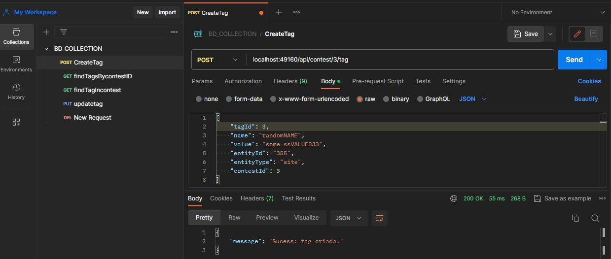
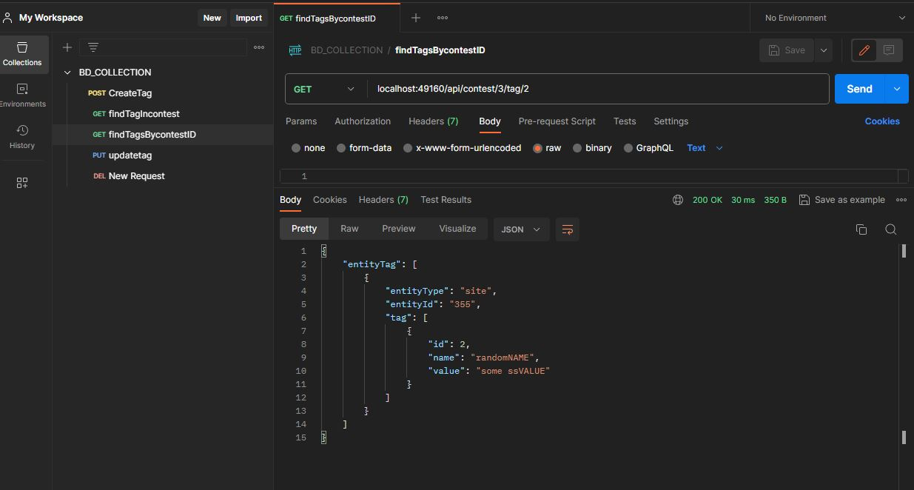
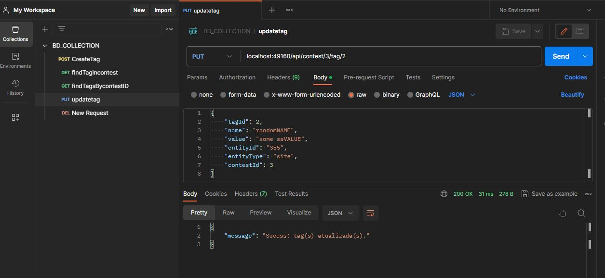
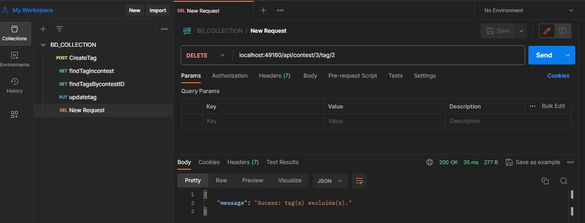
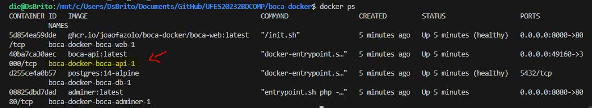
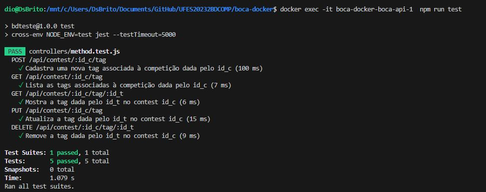
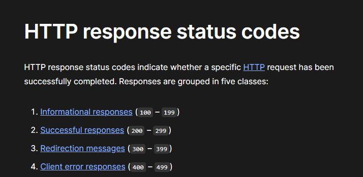

# UFES20232BDCOMP

# 🔎 Especifícação do Trabalho


<div  Align="justify">
<div Align="center"> </div>


<br/>
O objetivo do trabalho é poder criar e gerenciar tags para entidades do BOCA. Uma tag é uma espécie de rótulo que
pode ser atribuído a qualquer entidade. É um par de uma chave e um valor opcional que permite categorizar os recursos,
o que facilita a pesquisa. Por exemplo, aplicando uma tag chamada domain com o valor basic select em problemas de
interesse, um professor e/ou aluno podem obter uma lista de todos os exercícios de consultas básicas usando a API
REST.

</div>
<br/>
<br/>

# 💻 Pré-requisitos

Antes de começar, verifique se você atendeu aos seguintes requisitos:

- Hardware

  * Para o Docker Desktop:
    * Recomendado possuir processador Dual Core
    * Recomendado possuir 8GB de Ram (a instalação toma por volta de 2GB de disco)
  


- Software
  * Ter o Docker instalado na máquina, seja nativo ou o Docker Desktop
  * Ter postman instalado na máquina (ou um software parecido).
  * Ter o Node / npm instalado na máquina

<br/>


# 📁 Estrutura de Arquivos

Aqui podemos ver como os arquivos são estruturados no projeto em sua forma reduzida (ignorando os arquivos clonados anteriormente)


```
Root
│   docker-compose.api.yml
│   docker-compose.dev.yml
│   docker-compose.prod.yml
└── docker
    │     
    └─── dev
       │
       └─── api
            │
            └─── server.ts  - Aplicação principal 
            └─── schemas - Onde esta o modelo de entrada de dados.  
            └─── controller - Onde estão os métodos de controle (CRUD).
            └─── database   - Onde estão as migrations e a definição do banco.
            └─── queries    - Onde estãos as queries/ comandos em SQL.
            └─── routes     - Rotas da aplicação
      
```
<br/>
<br/>

# 👨‍💻 Executar a aplicação

Eu deixarei o projeto do João Fazolo  `boca-docker` clonado em meu projeto.

Dentro do diretório `./boca-docker` e do diretório `./boca-docker/docker/dev/api` é necessário utilizar os seguintes comandos:

```bash
# Buildar e Execultar os containers Docker
docker compose -f docker-compose.yml -f docker-compose.prod.yml -f docker-compose.api.yml up -d
docker compose -f docker-compose.yml -f docker-compose.prod.yml -f docker-compose.api.yml up -d --build
```
A porta a qual a aplicação foi atribuida é a `localhost:49160`.

<br/>
<br/>

# ⚡ Métodos

Requisições para a API devem seguir os padrões:

<div style="display: inline_block" align="center">


| Endpoint | Método | Funcionalidade |
| :---:                                       |     :---: |          :---:                                       |
| <:webservice>/api/contest/:id_c/tag         | `GET`     | Lista as tags associadas à competição dada pelo id_c |
| <:webservice>/api/contest/:id_c/tag         | `POST`    | Cadastra uma nova tag associada à competição dada pelo id_t |
| <:webservice>/api/contest/:id_c/tag/:id_t   | `GET`     | Mostra a tag dada pelo id_t no contest id_c          |
| <:webservice>/api/contest/:id_c/tag/:id_t   | `PUT`     | Atualiza a tag dada pelo id_t no contest id_c        |
| <:webservice>/api/contest/:id_c/tag/:id_t   | `DELETE`           | Remove a tag dada pelo id_t no contest id_c      |
<div style="display: inline_block" align="left">

<br/>
<br/>

# 🚀 Rotas

A aplicação possui as determinadas rotas:

```js
/* GET Lista as tags associadas à competição dada pelo id_c*/

localhost:49160/api/contest/:id_c/tag
```

  <div style="display: inline_block" align="center">
  
  <br /><br /> 
  <div style="display: inline_block" align="left">

---

```js
/* POST Cadastra uma nova tag associada à competição dada pelo id_c*/

localhost:49160/api/contest/:id_c/tag
```

<div style="display: inline_block" align="center">
  
  <br /><br /> 
  <div style="display: inline_block" align="left">

---

<br/>
<br/>

```js
/* GET Mostra a tag dada pelo id_t no contest id_c*/

localhost:49160/api/contest/:id_c/tag/:id_t
```
<div style="display: inline_block" align="center">
  
  <br /><br /> 
  <div style="display: inline_block" align="left">

---

<br/>
<br/>

```js
/*PUT tualiza a tag dada pelo id_t no contest id_c*/

localhost:49160/api/contest/:id_c/tag
```
<div style="display: inline_block" align="center">
  
  <br /><br /> 
  <div style="display: inline_block" align="left">

---
<br/>
<br/>

```js
/*DELETE Remove a tag dada pelo id_t no contest id_c*/

localhost:49160/api/contest/:id_c/tag/:id_t
```
<div style="display: inline_block" align="center">
  
  <br /><br /> 
  <div style="display: inline_block" align="left">


<br/>
<br/>

# 📚 Testes com a Aplicação

Os testes são automatizados usando as bibliotecas jest e supertest. O jest fornece funções para comparação e basicamente
comparamos se o resultado da chamada á aplicação é condizente com o retorno esperado. O supertest, fornece funções que são
usados para fazer as chamadas na própria aplicação.

<div style="display: inline_block" align="center">
  
  <br /><br /> 
  <div style="display: inline_block" align="left">


<br/>


Executando os testes:

        docker exec -it boca-docker-boca-api-1 npm run test


São feitos 5 testes para verificar se as funções principais estão funcionando (que estão presents na especifícação do trabalho). Os testes se complementam, então todos eles manipulam a mesma entidade e no fim, rodamos o último teste que é DELETE para limpar as alterações feitas no banco de dados. Veja abaixo o exemplo do POST e do GET.

  ```js

  describe("POST /api/contest/:id_c/tag", () => {
    it("Cadastra uma nova tag associada à competição dada pelo id_c", async () => {
        const res = await request(app).post("/api/contest/3/tag").send({
            tagId: 677,
            name: "teste tag creation",
            value: "some value",
            entityId: "333",
            entityType: "site",
            contestId: 3
        });
        expect(res.statusCode).toBe(200); //Verifica se o retorno é okay
    });
  });

```

No código acima acabamos de criar uma tag de id 677 no contest de número 3.
Então no próximo teste, um get, verificamos se essa tag existe no banco de dados.

```js

  describe("GET /api/contest/:id_c/tag/:id_t", () => {
    it("Mostra a tag dada pelo id_t no contest id_c", async () => {
        const res = await request(app).get("/api/contest/3/tag/677");
        const queryResponse = res.body.entityTag[0];

        expect(queryResponse.entityId).toBe('333');// Verifica se o id da entidade é 333
        expect(queryResponse.tag[0].id).toBe(677);//Verifica se o id da tag é 677
        expect(queryResponse.tag[0].name).toBe("teste tag creation");// Verifica se o name está correto
        expect(queryResponse.tag[0].value).toBe("some value");// Verifica se o value está correto

        expect(res.statusCode).toBe(200);
    });
  });

```
<br/>
<br/>
Imagem dos testes em execução abaixo:


<div style="display: inline_block" align="center">
  
  <br /><br /> 
  <div style="display: inline_block" align="left">


<br/>

### Respostas das requisições

As respostas foram retiradas do seguinte link :

 https://developer.mozilla.org/en-US/docs/Web/HTTP/Status
<div style="display: inline_block" align="center">
  
  <br /><br /> 
  <div style="display: inline_block" align="left">


<br/>

# 🤝 Desenvolvedores

<table>
  <tr>
    <td align="center">
      <a href="#">
        <br>
        <sub>
          <b style="color: orange">Dionatas Brito</b>
        </sub>
      </a>
    </td>
    <td align="center">
      <a href="#">
        <br>
        <sub>
          <b style="color: orange">Luiza Laquini</b>
        </sub>
      </a>
    </td>
  </tr>
</table>


<br/>

# 📝 Licença

Esse projeto está sob licença MIT. Veja o arquivo [LICENÇA](LICENSE) para mais detalhes.

<br/>

[⬆ Voltar ao topo](#UFES20232BDCOMP)<br>