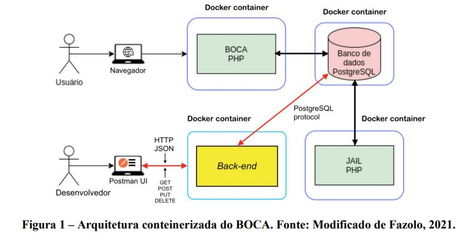

# UFES20232BDCOMP
//informações sobre os pré-requisitos de hardware e
software até mesmo comandos básicos para configurar o ambiente e implantar o serviço

 

# Sumario
- [Especificação do Trabalho](#Objetivo-do-Trabalho)
- [API](#Mode-de-Execução)
  - [Pré-requisitos](#Configuração)
    - Hardware
    - Software
    - Configuração do Ambiente

  - [Funcionamento](#Funcionamento)
    - [Tabelas]
    - Rotas
    - [Testes]

O objetivo do trabalho é poder criar e gerenciar tags para entidades do BOCA. Uma tag é uma espécie de rótulo que
pode ser atribuído a qualquer entidade. É um par de uma chave e um valor opcional que permite categorizar os recursos,
o que facilita a pesquisa. Por exemplo, aplicando uma tag chamada domain com o valor basic select em problemas de
interesse, um professor e/ou aluno podem obter uma lista de todos os exercícios de consultas básicas usando a API
REST.

